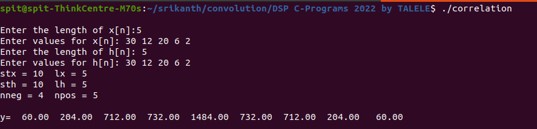
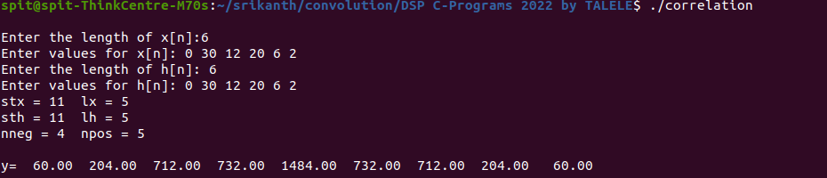
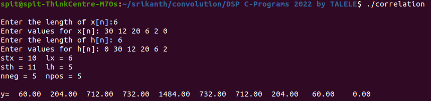

# Experiment No 2
- Name: Srikanth Kannan Iyengar
- UID: 2020400062
- 

## Aim: The aim of this experiment is To study mathematical operation  Correlation and measure degree of similarity between two signals.

### Code:
```c
/*
 * Name: Srikanth Iyengar
 * UID: 2020400062
 * Experiment 2: Discrete Correlation
 */

#include<stdio.h>
#define N 20
#define M 10

void correlate(float* x,float* h,float* y,int lx,int lh);
int detect(float* a, int* len);

int nneg,npos;

main()
{
	int lx,lh,i;
	float x[N],h[N],y[N];


	for(i=0;i<N;i++)
	{
		x[i]=0;   h[i]=0;   y[i]=0;
	}

	printf("\nEnter the length of x[n]:");
	scanf("%d",&lx);

	printf("Enter values for x[n]: ");
	for(i=0;i<lx;i++)
		scanf("%f",&x[M+i]);


	printf("Enter the length of h[n]: ");
	scanf("%d",&lh);

	printf("Enter values for h[n]: ");
	for(i=0;i<lh;i++)
		scanf("%f",&h[M+i]);

	correlate(x,h,y,lx,lh);

	printf("y=");
	for(i=M-nneg;i<(M+npos);i++)
		printf(" %6.2f ",y[i]);


        printf("\n\n");
}

void correlate(float* x,float* h,float* y,int lx,int lh)
{
	int i,j;
	float temp=0;
	int stx,sth;
	stx=detect(x,&lx);
	sth=detect(h,&lh);

	printf("stx = %d  lx = %d \n",stx,lx);

	printf("sth = %d  lh = %d \n",sth,lh);

	nneg=(sth-stx)+lh-1;
	npos=lx-(sth-stx);
	printf("nneg = %d  npos = %d \n\n",nneg,npos);

	for(i=-1*nneg;i<npos;i++)
	{
		temp=0;
		for(j=stx;j<(stx+lx);j++)
			temp+=x[j]*h[j-i];
		y[M+i]=temp;
	}

	
}

int detect(float* a, int* len)
{
	int i=0,s=0;
	while(s==0 & i< *len)
	{
		if(a[M+i] != 0)
			s=1;
		i++;
	}
	*len=*len-i+1;
	return(M+i-1);
}
```

## Q1)
- Problem Definition:
1. Find auto correlation of input signal and find the significance of value of output signal at n = 0. Let y[n] = x[n] O x[n]
2.  Classify the resultant signal( Even / Odd ).
3.  Calculate the energy of the signal.
4. What is the significance of the value of y[0]?
- Solution:
`x[n] = {30, 12, 20 6 2}`

a. **Output**

b. Since `y[n] = y[-n]`, That means, te autocorrelation output signal `y[n]` is an EVEN signal.
c. Energy of signal = 30^2 + 12^2 + 20^2 + 6^2 + 2^2 = 1484.
d. At n=0, y has maximum value which is equal to 1484.

## Q2)
- Problem Definition: Compare the resultant signal p[n] with y[n]. Give your conclusion.
Solution:
`x[n] = {0, 30, 12, 20, 6, 2}`
`x[n-1] = {0, 30, 12, 20, 6, 2}`


**We see that there is no change in the output if we right shift the input signal by 1 i.e. delayed signal**.

## Q3)
- Problem Definition:
```Find cross correlation of input signal and delayed  input signal

    q[n] = x[n]  0   x[n-1].

    Compare the resultant signal q[n] with p[n] and y[n]                         

    Give your conclusion.
 ```
 Solution:
`x[n] = {0, 30, 12, 20, 6, 2}`
`x[n-1] = {30, 12, 20, 6, 2, 0}`

Analysis:
**We notice that there is no change in the output signal but the output signal is also left shifted by 1.**
