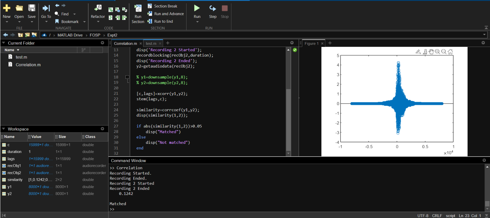

# Experiment No 3
- Name: Srikanth Kannan Iyengar
- UID: 2020400062
- Batch: 7
- Branch: IT
- Subject: Foundation Of Signal Processing

## Part A
### Aim: The aim of this experiment is To study mathematical operation  Correlation and measure degree of similarity between two signals.

## Q1)
- Problem Definition:
1. Find auto correlation of input signal and find the significance of value of output signal at n = 0. Let y[n] = x[n] O x[n]
2.  Classify the resultant signal( Even / Odd ).
3.  Calculate the energy of the signal.
4. What is the significance of the value of y[0]?
- Solution:
`x[n] = {30, 12, 20 6 2}`

a. **Output**\
\
b. Since `y[n] = y[-n]`, That means, te autocorrelation output signal `y[n]` is an EVEN signal.\
c. Energy of signal = 30^2 + 12^2 + 20^2 + 6^2 + 2^2 = 1484.\
d. At n=0, y has maximum value which is equal to 1484.

## Q2)
- Problem Definition: Compare the resultant signal p[n] with y[n]. Give your conclusion.\
Solution:\
`x[n] = {0, 30, 12, 20, 6, 2}`\
`x[n-1] = {0, 30, 12, 20, 6, 2}`

**We see that there is no change in the output if we right shift the input signal by 1 i.e. delayed signal**.\

## Q3)
- Problem Definition:
Find cross correlation of input signal and delayed  input signal q[n] = x[n]  O   x[n-1].  Compare the resultant signal q[n] with p[n] and y[n]                         

Give your conclusion.
 Solution:\
`x[n] = {0, 30, 12, 20, 6, 2}`\
`x[n-1] = {30, 12, 20, 6, 2, 0}`\
\
Analysis:\
**We notice that there is no change in the output signal but the output signal is also left shifted by 1.**

## Part B
### Aim: To make a program which is able to identify a person’s voice and phrases using correlation. (Voice password program)

**Case 1**: 
Two audio signals of same person saying same phrase

**Case 2**:
Two audio signals of same person saying different phrase

**Case 3**:
Two audio signals of different person saying same phrase

## Conclusion:
- Autocorrelation of a input signal remains same if we shift the signal or not since both the signals are same.
- If we take the correlation with the signal and a right shifted signal output signal is left shifted by 1.
