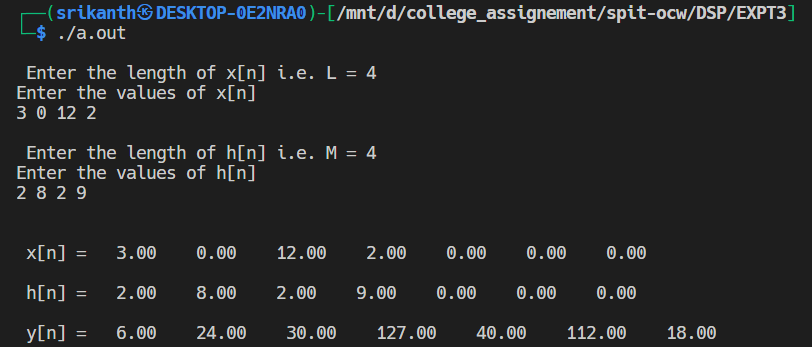
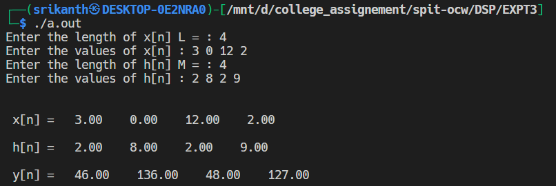
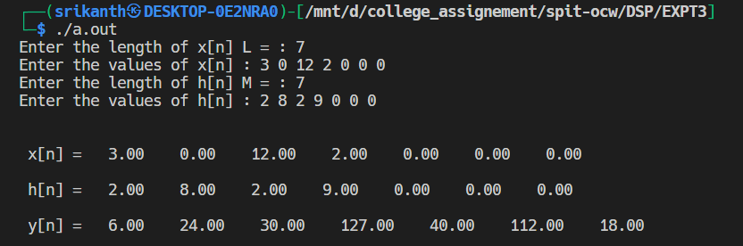
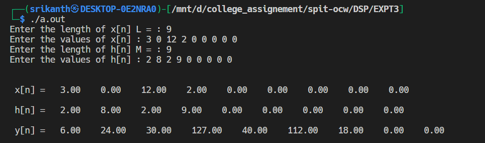

# Experiment No 3
- Name: Srikanth Kannan Iyengar
- UID: 2020400062
- Batch: 7
- Branch: IT
- Subject: Foundation Of Signal Processing

## Aim: The aim of this experiment is to study mathematical operations such as:
1. Linear convolution
2. Circular convolution
3. Linear using circular convolution

## Q1)
__Problem Definition__: Find Linear Convolution of L point sequence x[n] and M point sequence h[n]

__Experimentation__:\
__Case 1__:\
x[n] = [3, 0, 12, 2]\
h[n] = [2, 8, 2, 9]\
__Output__:\

y[n] = [6, 24, 30, 127, 40, 112, 18]

__Analysis__:\
Length of x[n] (L) = 4\
Length of h[n] (M) = 4\
Length of y[n] = L + M - 1 = 4 + 4 - 1 = 7

We conclude the following:
1. The length of convolution output is always L + M - 1. i.e. Sum of first input signal and second input signal minus 1.
2. Adding zeroes to the end of input does not change the convolution output.
3. If both input signals are causals then the resultant output signal is also causal
4. Linear convolution is commutative. It does not matter which signal you choose to shift.

## Q2):
__Problem Definition__: Find Circular Convolution of L point sequence x[n] and M point sequence h[n]

__Experimentation__:
__Case 1__:\
x[n] = [3, 0, 12, 2]\
h[n] = [2, 8, 2, 9]\
__Output__:

y[n] = [46, 136, 48, 127]

__Analysis__:
1. To do circular convolution it is necessary to have both the input signal of same length.
2. If the input signal are not have equal length we add zeroes to the end of shorter signal and make both the signals of equal length.
3. Output for the linear convolutions is [6, 24, 30, 127, 40, 112, 18], output for circular convolution is [46, 136, 48, 127]. We can observe that 4th element is same in both the output signal.
4. To explain this in a better way we can write the linear convolution output in the following format.\
[6,  24,  30, 127\
 \+ \+    +\
 40, 112, 18 ]
 we can see that the last three elements have beed added to the first three elements respectively this is aliased output.

## Q3):
__Problem Definition__: Find Linear Convolution of L point sequence x[n] and M point sequence h[n] using circular convolution.

__Case 1__:
x[n] = [3, 0, 12, 2]\
h[n] = [2, 8, 2, 9]

__Experimentation__:
Length of input signal is equal to the length of output signal of simple linear convolution

__Theory__:
Original length of x[n] (L) = 4
Original length of h[n] (M) = 4
In linear convolution length of output signal = L + M - 1 = 4 + 4 - 1 = 7.

Since length of both the input signal is less than 7 we make them equal by adding zeroes at the end of the signal.
Therefore\
x[n] = [3, 0, 12, 2, 0, 0, 0]

h[n] = [2, 8, 2, 9, 0, 0, 0]

__Output__:

y[n] = [6, 24, 30, 127, 30, 112, 18]

__Analysis__:
- We can see that the output of the circular convolution is equal to the output of simple linear convolution.
- When we take the period of the signal equal to L + M - 1 the output of circular convolution is equal to the output of simple linear convolution.

__Case 2__:
Length of the input signal signal is GREATER than the length of output of simple linear convolution

For case 2 we add extra zeroes at the end of both the signals.

__Output__:

__Analysis__:
- Final length of x[n] L = 9
- Final length of h[n] M = 9
- We can observe that the circular convoluted output is same as output of simple linear convolution but it is padded with extra zeroes at the end.
- For getting linear convolution from circular convolution the period should >= L + M - 1

## Conclusion:
1. Length of Linear Convolution output signal is N = L + M - 1
- where L is the length of first input signal
- where M is the length of second input signal
- N is the length of convolution output signal
2. In linear convolution if both input signals are causal, then resultant output signal is also causal.
3. To find Linear Convolution using Circular Convolution select N >= L + M - 1 Where L is the length of first input signal and M is the length of second input signal.
5. Circular Convolution gives aliased output.
