# Experiment 3: Vertical Fragmentation

- Name: Srikanth Iyengar
- UID: 2020400062
- Branch: IT
- Batch: G
- Subject: Advanced Database Management System

## Aim:
Design a distributed database by applying the concept of vertical fragmentation

## Implementation
### **Query for creation of table**
```sql
drop table if exists bank_details;


create table bank_details (
	acc_no integer ,
	cust_name varchar(100),
	mobile_no bigint,
	branch varchar(100),
	balance integer,
	loan_amount integer,
	amount_due integer,
	customer_id integer,
	date_of_birth date,
	transaction_no varchar(100),
	date_of_transaction date,
	mode_of_transaction varchar(100),
	transaction_type varchar(100),
	transaction_amount integer,
	primary key (acc_no, customer_id)
);


drop table if exists customer, customer_transaction, customer_loan;
INSERT INTO bank_details (acc_no, cust_name, mobile_no, branch, balance, loan_amount, amount_due, customer_id, date_of_birth, transaction_no, date_of_transaction, mode_of_transaction, transaction_type, transaction_amount)
VALUES
  (1001, 'John Doe', 9876543210, 'Central Branch', 5000, 10000, 500, 101, '1980-01-01', 'T1001', '2023-02-01', 'Cash', 'Deposit', 1000),
  (1002, 'Jane Doe', 9876543211, 'Central Branch', 6000, 20000, 1000, 102, '1982-02-01', 'T1002', '2023-02-02', 'Cheque', 'Withdrawal', 500),
  (1003, 'John Smith', 9876543212, 'West Branch', 7000, 30000, 1500, 103, '1984-03-01', 'T1003', '2023-02-03', 'Net Banking', 'Deposit', 2000),
  (1004, 'Jane Smith', 9876543213, 'West Branch', 8000, 40000, 2000, 104, '1986-04-01', 'T1004', '2023-02-04', 'Cash', 'Withdrawal', 800),
  (1005, 'Bob Brown', 9876543214, 'South Branch', 9000, 50000, 2500, 105, '1988-05-01', 'T1005', '2023-02-05', 'Cheque', 'Deposit', 1500),
  (1006, 'Alice Brown', 9876543215, 'South Branch', 10000, 60000, 3000, 106, '1990-06-01', 'T1006', '2023-02-06', 'Net Banking', 'Withdrawal', 700),
  (1007, 'Charlie Smith', 9876543216, 'East Branch', 11000, 70000, 3500, 107, '1992-07-01', 'T1007', '2023-02-07', 'Cash', 'Deposit', 1700),
  (1008, 'Emily Smith', 9876543217, 'East Branch', 12000, 80000, 4000, 108, '1994-08-01', 'T1008', '2023-02-08', 'Cheque', 'Withdrawal', 900),
  (1009, 'David Brown', 9876543218, 'North Branch', 13000, 90000, 4500, 109, '1996-09-01', 'T1009', '2023-02-09', 'Net Banking', 'Deposit', 1900),
  (1010, 'Emma Brown', 9876543219, 'North Branch', 14000, 100000, 5000, 110, '1998-10-01', 'T1010', '2023-02-10', 'Cash', 'Withdrawal', 1100);
select * from bank_details;


create table customer (
	acc_no integer ,
	cust_name varchar(100),
	mobile_no bigint,
	branch varchar(100),
	balance integer,
	date_of_birth date,
	customer_id integer,
	primary key (acc_no, customer_id)
);


insert into customer (select acc_no, cust_name, mobile_no, branch, balance, date_of_birth, customer_id from bank_details);
select * from customer;
create table customer_loan (
	acc_no integer,
	amount_due integer,
	customer_id integer,
	loan_amount integer,
	primary key (acc_no, customer_id)
);

insert into customer_loan (select acc_no, amount_due, customer_id, loan_amount from bank_details);

drop table if exists customer_transaction;
create table customer_transaction (
	acc_no integer,
	customer_id integer,
	transaction_no varchar(100),
	date_of_transaction date,
	transaction_type varchar(100),
	mode_of_transaction varchar(100),
	transaction_amount integer,
	primary key (acc_no, customer_id)
);
insert into customer_transaction (select acc_no, customer_id, transaction_no, date_of_transaction, transaction_type , mode_of_transaction , transaction_amount from bank_details);
select * from (customer join customer_loan using (acc_no) ) join customer_transaction using (acc_no);
select * from customer_transaction;
```

## **PART A**
### Query 1
```sql
-- find all the customer with branch ANDHERI
SELECT * FROM (
	SELECT * FROM (
	(SELECT * FROM customer WHERE branch = 'ANDHERI') y join (SELECT * FROM customer_loan) z using (acc_no)
) x JOIN (SELECT * FROM customer_transaction) q USING (acc_no)) w;
```
**Result From table 1**
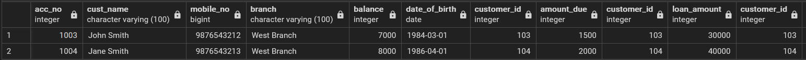

### Query 2
```sql
-- find all the customer who have done NET BANKING transaction
SELECT * FROM (
	SELECT * FROM (
	(SELECT * FROM customer) y join (SELECT * FROM customer_loan) z using (acc_no)
) x JOIN (SELECT * FROM customer_transaction WHERE transaction_type = 'Deposit') q USING (acc_no)) w;
```
**Result From table 1**
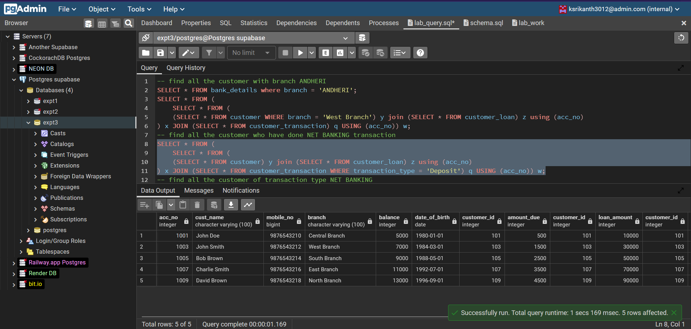

### Query 3
```sql
-- find all the customer of transaction type NET BANKING
SELECT * FROM (
	SELECT * FROM (
	(SELECT * FROM customer) y join (SELECT * FROM customer_loan) z using (acc_no)
) x JOIN (SELECT * FROM customer_transaction WHERE mode_of_transaction = 'Net Banking') q USING (acc_no)) w;
```
**Result From table 1**
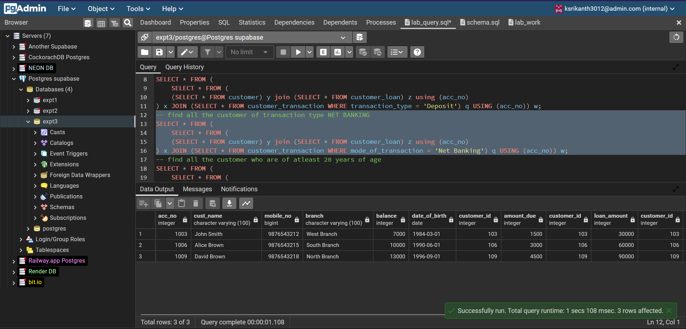

### Query 4
```sql
-- find all the customer who are of atleast 20 years of age
SELECT * FROM (
	SELECT * FROM (
	(SELECT * FROM customer where date_part('year', current_date) - date_part('year', date_of_birth) > 35 ) y join (SELECT * FROM customer_loan) z using (acc_no)
) x JOIN (SELECT * FROM customer_transaction ) q USING (acc_no)) w;
```
**Result From table 1**
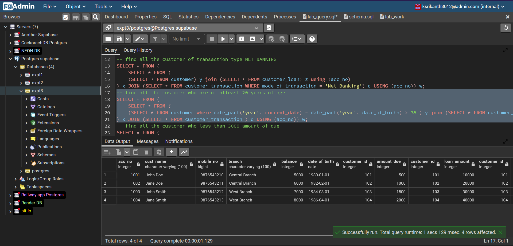

### Query 5
```sql
-- Find all the customer who less than 3000 amount of due
SELECT * FROM (
	SELECT * FROM (
	(SELECT * FROM customer ) y join (SELECT * FROM customer_loan where amount_due < 3000) z using (acc_no)
) x JOIN (SELECT * FROM customer_transaction ) q USING (acc_no)) w;
```
**Result From table 1**
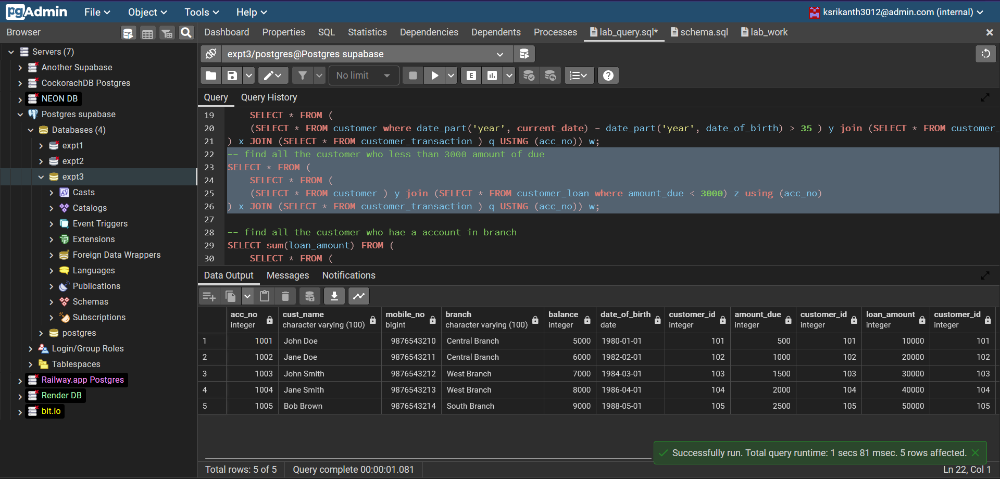

### Query 6
```sql
-- Find all the customer who has a account in branch 
SELECT sum(loan_amount) FROM (
	SELECT * FROM (
	(SELECT * FROM customer WHERE branch = 'Central Branch') y join (SELECT * FROM customer_loan) z using (acc_no)
) x JOIN (SELECT * FROM customer_transaction ) q USING (acc_no)) w;
```
**Result From table 1**
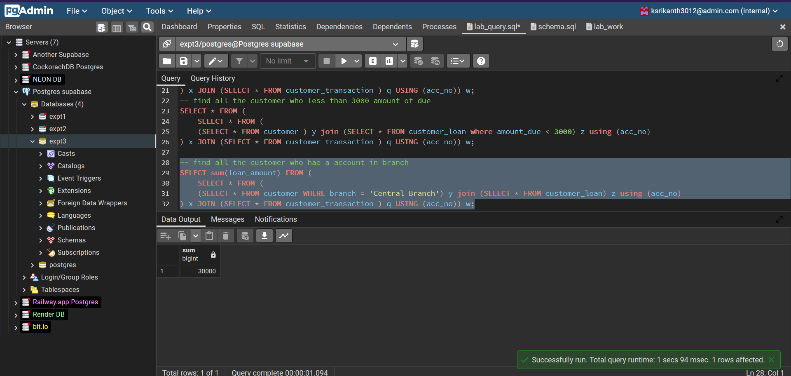


## **PART B**
## Implementation of part B
### **Flight Table**
| Flight Id | Flight Name | Source | Destination | Tickets Available|
|--|--|--|--|--|
|1| Transatlantic Express| New York| London| 100|
|2| City Hopper| London| Paris| 90|
|3| European Voyager| Paris| Berlin| 80|
|4| Continent Cruiser| Berlin| Rome| 70|
|5| Mediterranean Flyer| Rome| Madrid| 60|
|6| Iberian Explorer| Madrid| Barcelona| 50|
|7| Nordic Adventurer| Barcelona| Amsterdam| 40|
|8| Oceanic Odyssey| Amsterdam| New York| 30|
|9| Atlantic Ascension| New York| London| 20|
|10| Skyline Shuttle| London| Paris| 10|
|11| Continental Commuter| Paris| Berlin| 20|
|12| Bella Italia| Berlin| Rome| 30|
|13| España Express| Rome| Madrid| 40|
|14| Dutch Delight| Madrid| Barcelona| 50|
|15| Viking Venture| Barcelona| Amsterdam| 60|
|16| Big Apple Bounce| Amsterdam| New York| 70|
|17| British Airways| New York| London| 80|
|18| French Connection| London| Paris| 90|
|19| German Getaway| Paris| Berlin| 100|
|20| Italian Holiday| Berlin| Rome| 110|
### **App user Table**
| Username | Password | Tickets Booked| Location |
| -- | -- | -- | -- |
|johndoe123| 5f4dcc3b5aa765d61d8327deb882cf99| 2| New York|
|janedoe456| 5e884898da28047151d0e56f8dc62927| 1| London|
|bobsmith789| 21232f297a57a5a743894a0e4a801fc3| 4| Paris|
|alicebrown101| ee11cbb19052e40b07aac0ca060c23ee| 0| Berlin|
|tomgreen202| 25f9e794323b453885f5181f1b624d0b| 3| Madrid|
|jennypink303| a665a45920422f9d417e4867efdc4fb8| 5| Rome|
|chrisblack404| 5d41402abc4b2a76b9719d911017c592| 6| Moscow|
|kimwhite505| bdbafc1b5f5dc8ab2f0196b5cd543a33| 7| Toronto|
|paulred606| 1a1dc91c907325c69271ddf0c944bc72| 8| Sydney|
|lucyyellow707| ac0eafeed417f0ffa7befa0d1c01a7a6| 9| Seoul|
|mikeblue808| 098f6bcd4621d373cade4e832627b4f6| 10| Tokyo|
|sarahpurple909| 0b7c75b0f4b7e585a1c73e72409f3b7c| 11| Shanghai|
|davidorange010| 76a2173be6393254e72ffa4d6df1030a| 12| Beijing|
|emmablack112| c1dfd96eea8cc2b62785275bca38ac26| 13| Mexico City|
|danielgreen213| 98f13708210194c475687be6106a3bce| 14| Rio de Janeiro|
|elizabethpurple314| f0d2f1e2dc9abceb877557a483e07c3a| 15| Sao Paulo|
|richardblue415| 5ab5dbc27120680fa6f0b6ed7b6c0098| 16| Buenos Aires|
|jenniferred516| 7c222fb2927d828af22f592134e89324| 17| Lima|
|robertyellow617| 7a74f16c3e7d20a03b356f7bcf8c8f7a| 18| Bogota|

### Query for creation of required tables
```sql
drop table if exists app_user;

CREATE TABLE IF NOT EXISTS public.app_user
(
    username character varying(100) COLLATE pg_catalog."default" NOT NULL,
    user_password character varying(100) COLLATE pg_catalog."default",
    tickets_booked integer,
	address varchar(100),
    CONSTRAINT app_user_pkey PRIMARY KEY (username)
);

INSERT INTO public.app_user (username, user_password, tickets_booked, address)
VALUES 
('johndoe123', '5f4dcc3b5aa765d61d8327deb882cf99', 2, 'New York'),
('janedoe456', '5e884898da28047151d0e56f8dc62927', 1, 'London'),
('bobsmith789', '21232f297a57a5a743894a0e4a801fc3', 4, 'Paris'),
('alicebrown101', 'ee11cbb19052e40b07aac0ca060c23ee', 0, 'Berlin'),
('tomgreen202', '25f9e794323b453885f5181f1b624d0b', 3, 'Madrid'),
('jennypink303', 'a665a45920422f9d417e4867efdc4fb8', 5, 'Rome'),
('chrisblack404', '5d41402abc4b2a76b9719d911017c592', 6, 'Moscow'),
('kimwhite505', 'bdbafc1b5f5dc8ab2f0196b5cd543a33', 7, 'Toronto'),
('paulred606', '1a1dc91c907325c69271ddf0c944bc72', 8, 'Sydney'),
('lucyyellow707', 'ac0eafeed417f0ffa7befa0d1c01a7a6', 9, 'Seoul'),
('mikeblue808', '098f6bcd4621d373cade4e832627b4f6', 10, 'Tokyo'),
('sarahpurple909', '0b7c75b0f4b7e585a1c73e72409f3b7c', 11, 'Shanghai'),
('davidorange010', '76a2173be6393254e72ffa4d6df1030a', 12, 'Beijing'),
('emmablack112', 'c1dfd96eea8cc2b62785275bca38ac26', 13, 'Mexico City'),
('danielgreen213', '98f13708210194c475687be6106a3bce', 14, 'Rio de Janeiro'),
('elizabethpurple314', 'f0d2f1e2dc9abceb877557a483e07c3a', 15, 'Sao Paulo'),
('richardblue415', '5ab5dbc27120680fa6f0b6ed7b6c0098', 16, 'Buenos Aires'),
('jenniferred516', '7c222fb2927d828af22f592134e89324', 17, 'Lima'),
('robertyellow617', '7a74f16c3e7d20a03b356f7bcf8c8f7a', 18, 'Bogota');


drop table if exists flight;

CREATE TABLE IF NOT EXISTS public.flight
(
    flight_id integer NOT NULL,
    flight_name character varying(100) COLLATE pg_catalog."default" NOT NULL,
    flight_source character varying(100) COLLATE pg_catalog."default" NOT NULL,
    flight_destination character varying(100) COLLATE pg_catalog."default" NOT NULL,
    tickets_available integer NOT NULL,
    CONSTRAINT flight_pkey PRIMARY KEY (flight_id)
);


insert into flight values 
(1, 'Transatlantic Express', 'New York', 'London', 100),
(2, 'City Hopper', 'London', 'Paris', 90),
(3, 'European Voyager', 'Paris', 'Berlin', 80),
(4, 'Continent Cruiser', 'Berlin', 'Rome', 70),
(5, 'Mediterranean Flyer', 'Rome', 'Madrid', 60),
(6, 'Iberian Explorer', 'Madrid', 'Barcelona', 50),
(7, 'Nordic Adventurer', 'Barcelona', 'Amsterdam', 40),
(8, 'Oceanic Odyssey', 'Amsterdam', 'New York', 30),
(9, 'Atlantic Ascension', 'New York', 'London', 20),
(10, 'Skyline Shuttle', 'London', 'Paris', 10),
(11, 'Continental Commuter', 'Paris', 'Berlin', 20),
(12, 'Bella Italia', 'Berlin', 'Rome', 30),
(13, 'España Express', 'Rome', 'Madrid', 40),
(14, 'Dutch Delight', 'Madrid', 'Barcelona', 50),
(15, 'Viking Venture', 'Barcelona', 'Amsterdam', 60),
(16, 'Big Apple Bounce', 'Amsterdam', 'New York', 70),
(17, 'British Airways', 'New York', 'London', 80),
(18, 'French Connection', 'London', 'Paris', 90),
(19, 'German Getaway', 'Paris', 'Berlin', 100),
(20, 'Italian Holiday', 'Berlin', 'Rome', 110);

DROP TABLE IF EXISTS flight_transaction;

CREATE TABLE flight_transaction (
    transaction_id SERIAL PRIMARY KEY,
    username VARCHAR(100) NOT NULL,
    flight_id INTEGER NOT NULL,
    tickets_booked INTEGER NOT NULL,
    transaction_time TIMESTAMP DEFAULT NOW(),
    FOREIGN KEY (username) REFERENCES app_user(username),
    FOREIGN KEY (flight_id) REFERENCES flight(flight_id)
);


INSERT INTO flight_transaction (username, flight_id, tickets_booked)
SELECT 
    u.username,
    f.flight_id,
    (CASE WHEN u.tickets_booked < f.tickets_available THEN u.tickets_booked ELSE f.tickets_available END) as tickets_booked
FROM app_user u 
INNER JOIN flight f ON (u.address = f.flight_source)
WHERE u.tickets_booked > 0 AND f.tickets_available > 0;

DROP TABLE IF EXISTS big_table;

CREATE TABLE big_table AS
SELECT au.username, au.user_password, au.address, f.flight_id, f.flight_name, f.flight_source, f.flight_destination, f.tickets_available, ft.transaction_id, ft.tickets_booked, ft.transaction_time
FROM app_user AS au
JOIN flight_transaction AS ft ON au.username = ft.username
JOIN flight AS f ON ft.flight_id = f.flight_id;
```

### Table creation output:
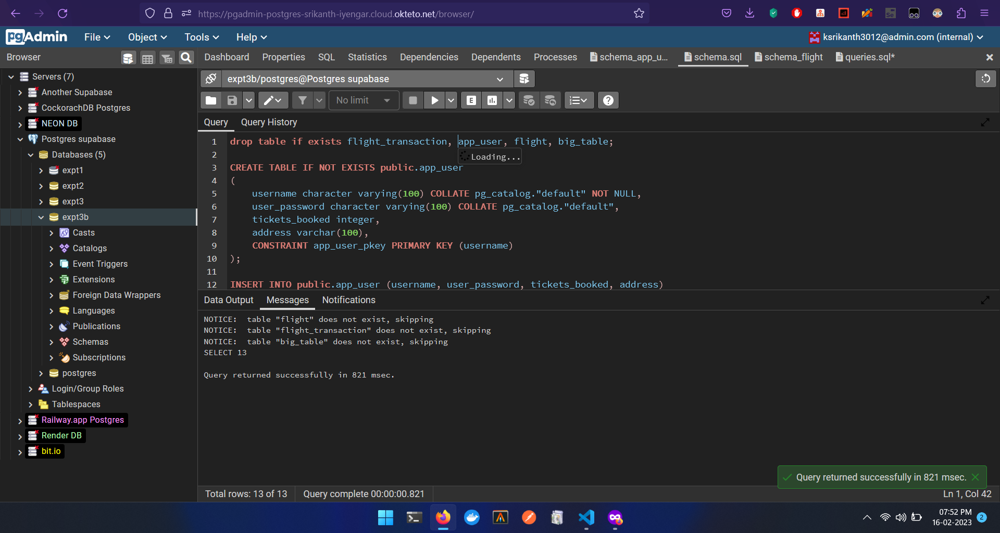


### Query 1
```sql
-- What are the total number of tickets booked by each user?
SELECT app_user.username, SUM(flight_transaction.tickets_booked) AS total_tickets_booked
FROM app_user
INNER JOIN flight_transaction ON app_user.username = flight_transaction.username
GROUP BY app_user.username;
```

### Result:
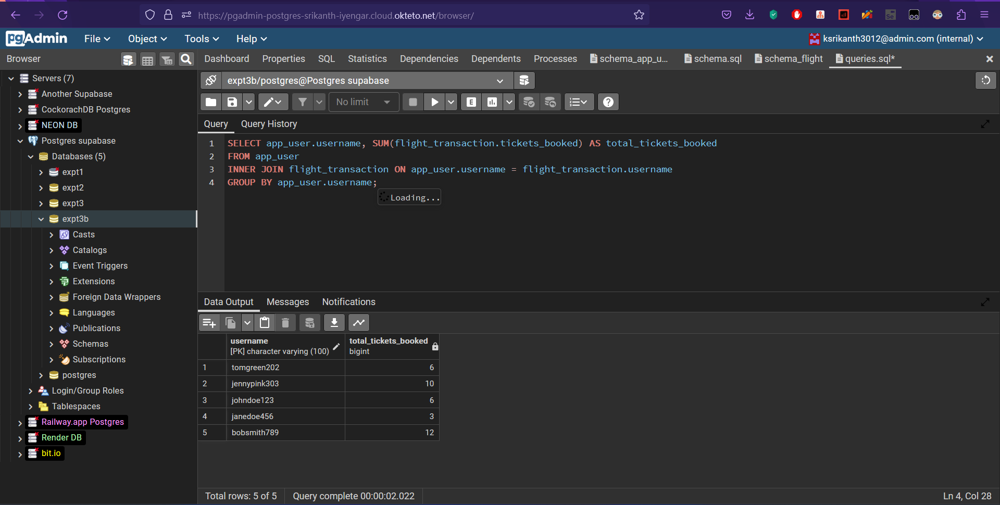

### Query 2
```sql
-- What are the flight details of all transactions where more than 10 tickets were booked?
SELECT app_user.username, SUM(flight_transaction.tickets_booked) AS total_tickets_bookedSELECT flight_transaction.*, flight.*
FROM flight_transaction
INNER JOIN flight ON flight_transaction.flight_id = flight.flight_id
WHERE flight_transaction.tickets_booked > 3;
```

### Result:
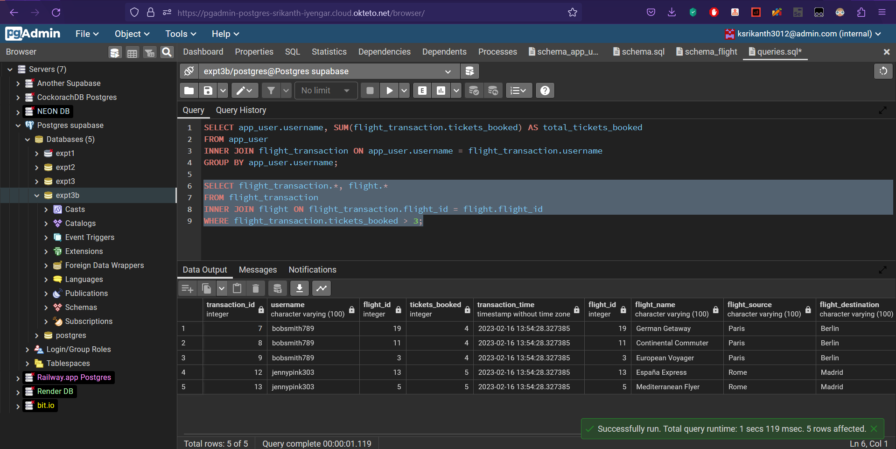

### Query 3
```sql
--What are the total number of tickets booked for each flight, and how many tickets are available for each flight?
SELECT flight.flight_name, flight.tickets_available, SUM(flight_transaction.tickets_booked) AS total_tickets_booked
FROM flight
LEFT JOIN flight_transaction ON flight.flight_id = flight_transaction.flight_id
GROUP BY flight.flight_name, flight.tickets_available;
```

### Resut:
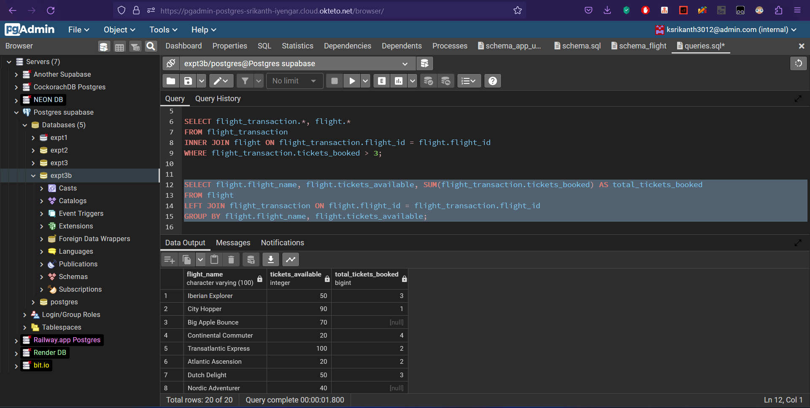

### Query 4
```sql
-- What are the flight details of all transactions made by users whose username starts with the letter "J"?
SELECT flight_transaction.*, flight.*, app_user.*
FROM flight_transaction
INNER JOIN flight ON flight_transaction.flight_id = flight.flight_id
INNER JOIN app_user ON flight_transaction.username = app_user.username
WHERE app_user.username LIKE 'j%';
```

### Result:
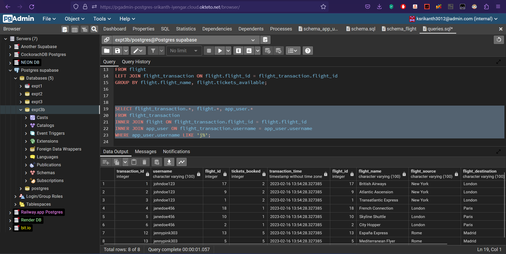


### Query 5
```sql
-- What are the top 5 flights with the highest number of tickets booked?
SELECT f.flight_name, COUNT(ft.tickets_booked) AS total_tickets_booked
FROM flight f
JOIN flight_transaction ft ON f.flight_id = ft.flight_id
GROUP BY f.flight_name
ORDER BY total_tickets_booked DESC
LIMIT 5;
```

### Result:
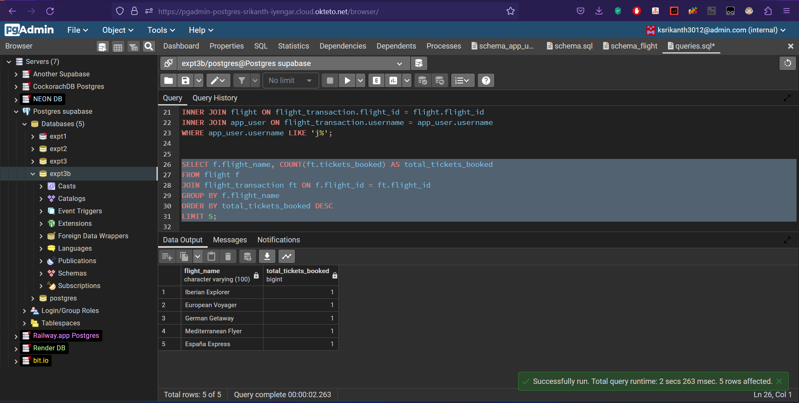


## Conclusion
Learned how to design a distributed database by applying the concept of vertical fragmentation in PostgreSQL.