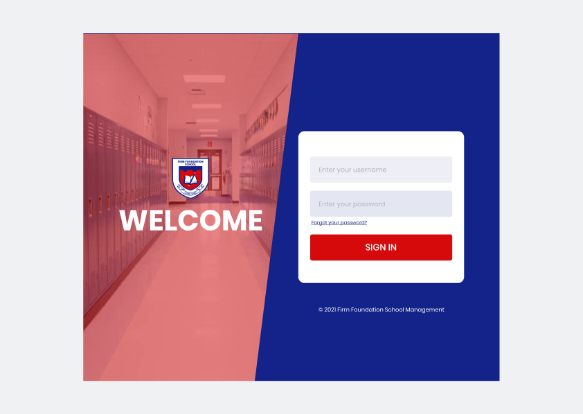
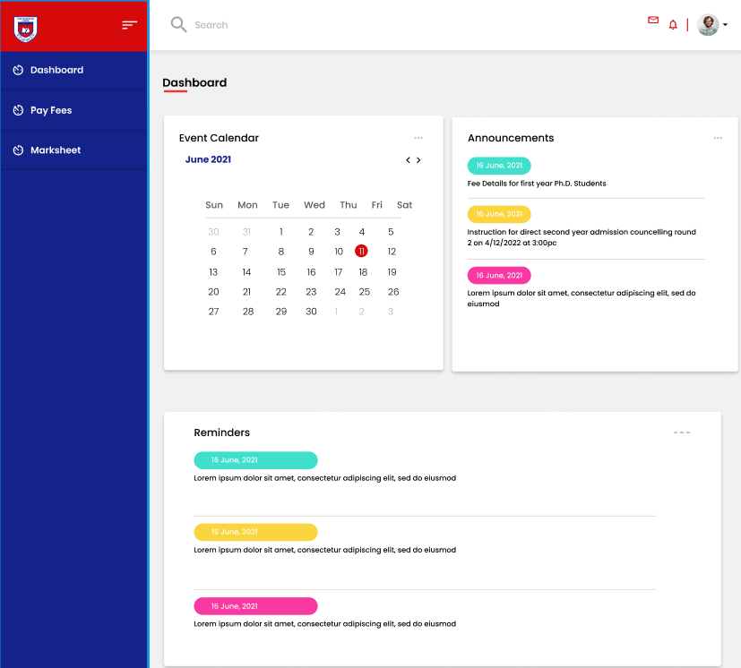
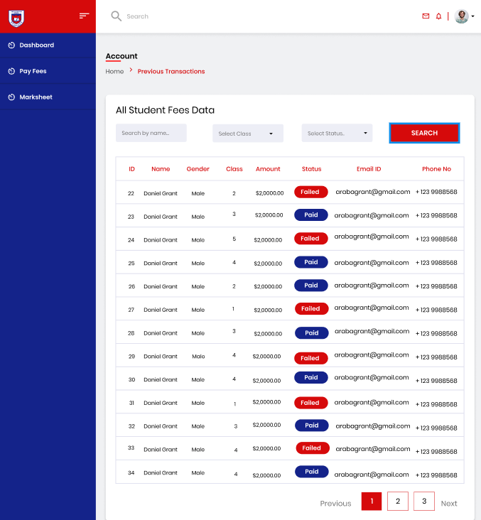
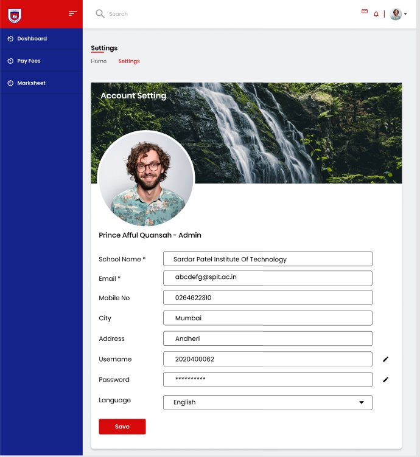
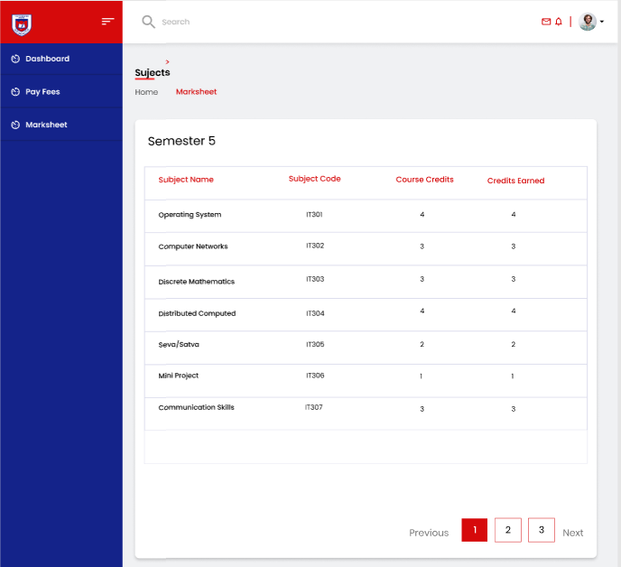
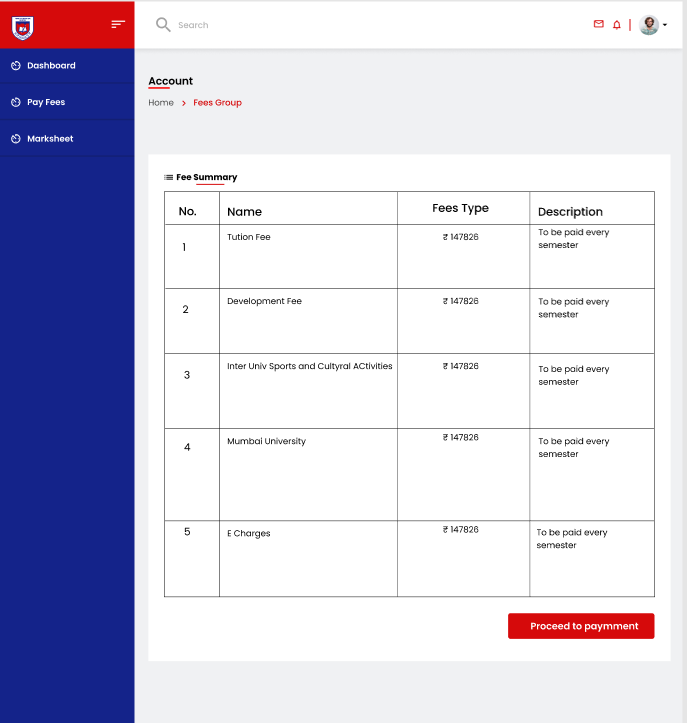
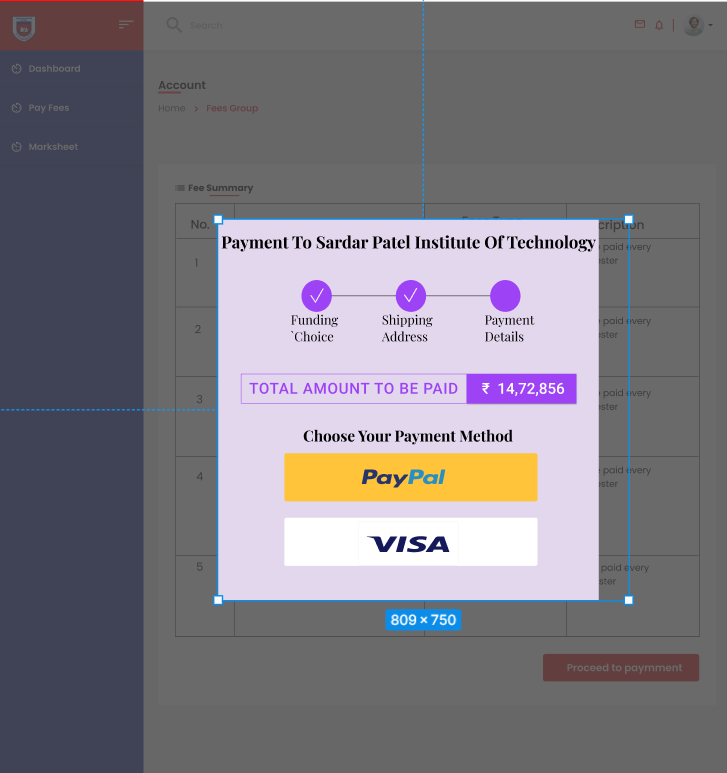

# Expt 1 - UX Tools Comparison and Student Transcript System Design

- Name: Srikanth Iyengar
- UID: 2020400062
- Branch: IT
- Batch: I
- Subject: Human Machine Interaction
- Course Code: OECS4

## Aim: 
To study open source UX tools (Justinmind Prototype, Pidoco, Marvel Prototype, Figma) and create a simple design for a given problem definition

## Theory: 
### Justinmind:
- Offers drag-and-drop interface for designing wireframes, prototypes and UI elements.
- Supports collaboration with team members in real-time.
- Has a wide range of UI libraries and icons.

### Pidco:
- Provides a flexible and intuitive drag-and-drop interface for wireframing, prototyping and user testing.
- Includes collaboration features, such as comments and feedback.
- Offers both desktop and mobile prototyping.

### Figma:
- Offers a collaborative and browser-based interface for designing and prototyping.
- Provides real-time collaboration and versioning for team members.
- Offers a wide range of design tools and a library of UI components.

### Comparison Table

| Features | Figma | Pidoco | Marvel | Justinmind |
| --- | -- | -- | -- | --- |
| Animation | Available | Not Available | Available | Available
| Collaboration | Most Advanced | Less Advanced | Less Advanced | Less Advanced |
| Learning curve | Steeper Learning Curve | Easier to pick up and use | Moderate learning curve | Moderate learning curve |
| Pricing | Offer free plans with limited features and paid plans with additional features | Offer free trials and paid plans with varying features and pricing | Offer free trials and paid plans with varying features and pricing | Offer free plans with limited features and paid plans with additional features |
| Prototype Quality | High-fidelity prototypes | Low-fidelity prototypes | Low-fidelity prototypes | High-fidelity prototypes |
| User Interface | Modern and Intuitive UI | Traditional UI | Modern UI |Modern UI |
| Deployment And Support | Cloud, SaaS, web based, Mac, Windows, Linux operating systems | Cloud, SaaS, web based only | Cloud, SaaS, web based, Android, iphone, ipad | Cloud, SaaS, web based, Mac, Windows, Android, iphone, ipad | 

## Screenshot

| | | |
| -- | -- | -- |
|  |  | 
|  |  |
|  |  
|  |